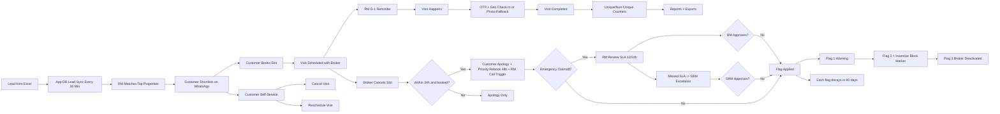

# Proptech MVP Workflow Chart

## What this MVP solves

1. Reduce dependency on brokers
2. Faster lead-to-visit execution
3. Better broker accountability
4. Better RM control and visibility

## End-to-end flow

## Role-wise screens

1. Broker
- Inventory add/remove
- Slot calendar
- Scheduled visits
- OTP send and completion

2. RM
- Duplicate review queue
- Emergency approval queue
- WhatsApp logs and template test send
- Funnel and reliability reports
- CSV exports

3. SRM
- Escalation queue and emergency decision

4. Customer self-service
- Load visits by phone
- Cancel or reschedule

## Verification and policy rules

1. Duplicate listings
- Similarity above 75%: hidden from customer + RM review
- Similarity above 95%: auto-hidden + RM review

2. Visit completion
- OTP valid for 2 minutes, max 3 attempts
- Geo radius 200 meters
- Photo fallback if GPS fails

3. Cancellation policies
- Broker cannot reject customer directly, only slot control
- Booked cancel within 24h triggers strict workflow

4. Lifecycle accounting
- Unique visit = customer's first completed lifetime visit
- Non-unique tracked separately

## Sharing note

This file can be shared directly as Markdown, copied to Notion, or exported as PDF for non-technical stakeholders.
